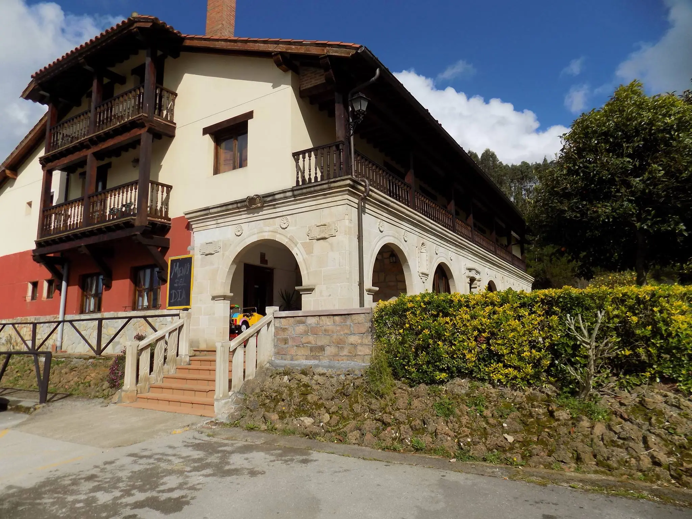
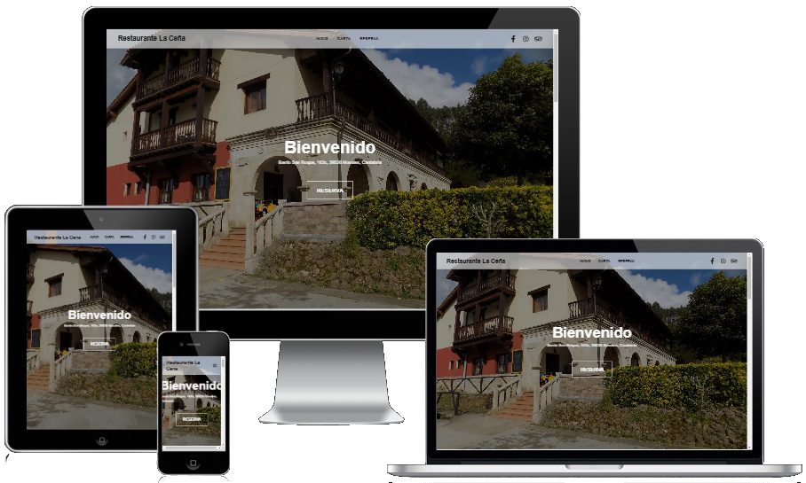
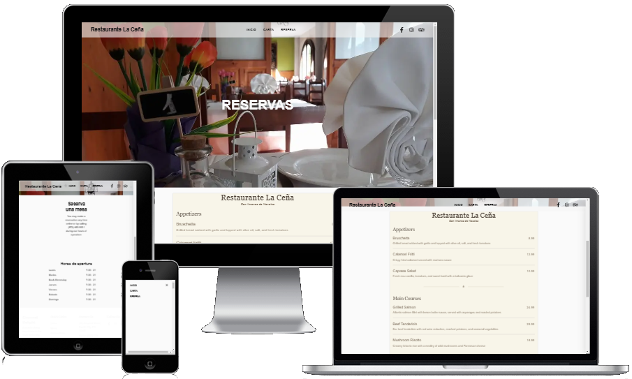

# Restaurante La Ceña 🌮🍷

Web de presentación del restaurante y la posada La Ceña.
Esta landing page es **responsiva** y está diseñada con soporte para **multilenguaje**. Su propósito es proporcionar una experiencia visual y funcional atractiva para los visitantes del sitio.

---

## ✨ Características principales
* Diseño moderno y adaptable a dispositivos móviles (responsive).

* Contenido en varios idiomas para llegar a una audiencia más amplia (multilenguaje).

* Construido con tecnologías modernas para un rendimiento óptimo.

---

## 🚀 Requisitos del sistema

Antes de empezar, asegúrate de tener instalado:

- **Node.js**: `v20.18.1`
- **npm**: `v10.2.3`
- **Next.js**: `v15.0.3`
- **React**: `v18.3.1`

---

## 📥 Instalación

1. **Clonar el repositorio**

```bash
git clone https://github.com/AQM19/restaurante-la-cenia.git
cd restaurante-la-cena
```

2. **Instalar dependencias**
```bash
npm install
```

3. **Ejecutar el servidor de desarrollo**
```bash
npm run dev

```
El sitio estará disponible en [localhost:3000](http://localhost:3000).

---

## 📤 Despliegue

#### Despliegue en Vercel

Este proyecto está optimizado para ser desplegado en [Vercel](https://vercel.com/aqm19s-projects/restaurante-la-cenia).

- Inicia sesión en tu cuenta de Vercel.
- Conecta el repositorio desde el panel de control de Vercel.
- Configura las variables de entorno necesarias en el panel de Vercel.
- Realiza el despliegue directamente desde la plataforma.


---

## 📷 Capturas de pantalla






---

## 🛠️ Tecnologías utilizadas

- **Next.js**: Framework para React con optimización de servidor y cliente.
- **React**: Biblioteca para crear interfaces de usuario interactivas.
- **TailwindCSS**: (Si lo usas) Para estilizar la web de forma eficiente y responsiva.
- **i18next**: (Si lo usas) Gestión de traducciones para soporte multilenguaje.

---

## 📚 Scripts disponibles

- **npm run dev**: Ejecuta el entorno de desarrollo.
- **npm run build**: Genera los archivos optimizados para producción.
- **npm start**: Ejecuta el servidor de producción.
- **npm run lint**: Revisa el código para asegurarse de que sigue las mejores prácticas.

---

## 🌍 Multilenguaje

El sitio soporta múltiples idiomas. Por defecto, está configurado en español, pero puedes añadir soporte para otros idiomas modificando la configuración en el archivo next-i18next.config.js (si usas i18next) o la configuración de tu proyecto.
